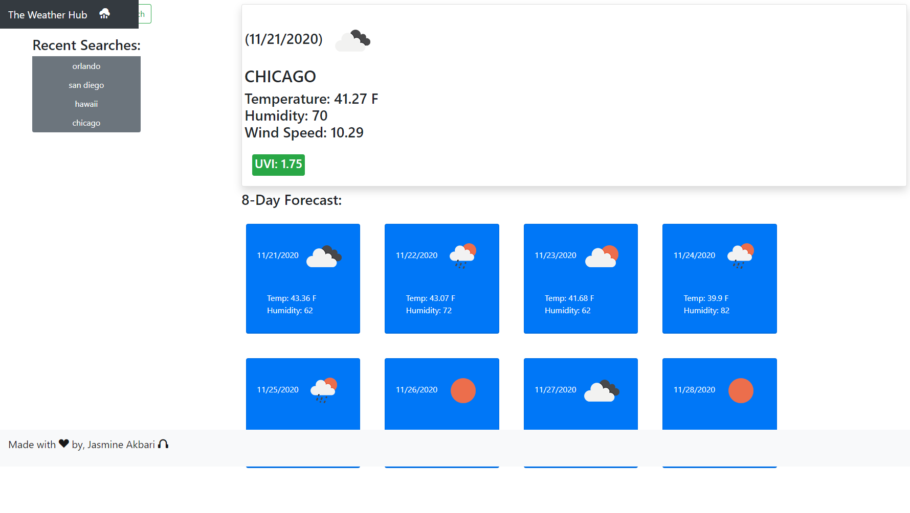

# weather-hub
<h3>Purpose</h3>

This weather application was created with the Open Weather Map Server Side API. Upon searching a city you will be presented with the current date, weather icon, and weather information. The UV Index will be highlighted based on the favorable status of the value displayed. You will also be provided an 8 day forecast with dates, icons and weather information.

Your recent searches will be saved as buttons on the left side for you to revisit by clicking the name of the city you would like to see again.

<h3>Built With:</h3>
<ul>
<li>HTML</li>
<li>Javascript</li>
<li>Bootstrap</li>
<li>OpenWeatherMap</li>
</ul>

<h3>Link To the Application:</h3>
<a href="https://jasmineakbari.github.io/weather-hub/">https://jasmineakbari.github.io/weather-hub/</a>

<h3>Image of the Application:<h3>

<h3>Contribution</h3>

Made with ❤️ by [Jasmine Akbari]
 